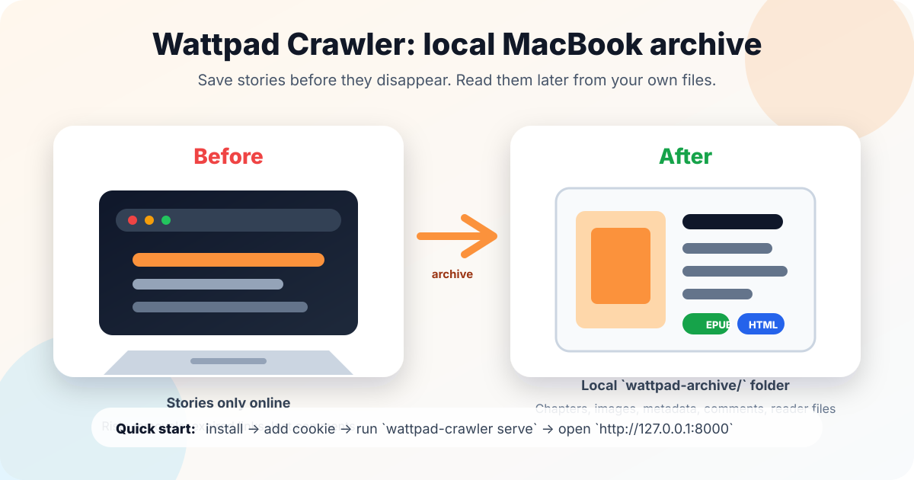
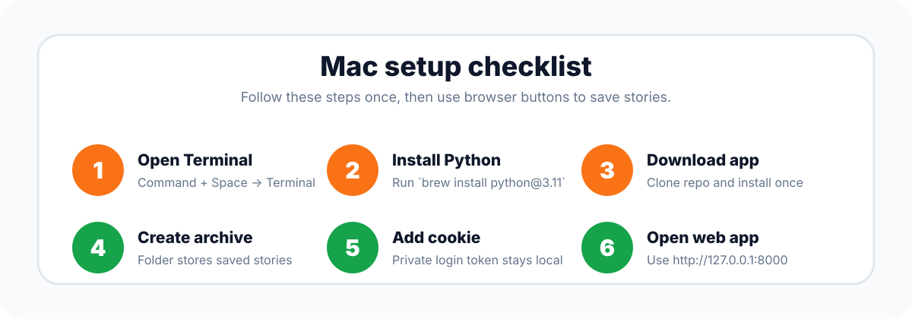
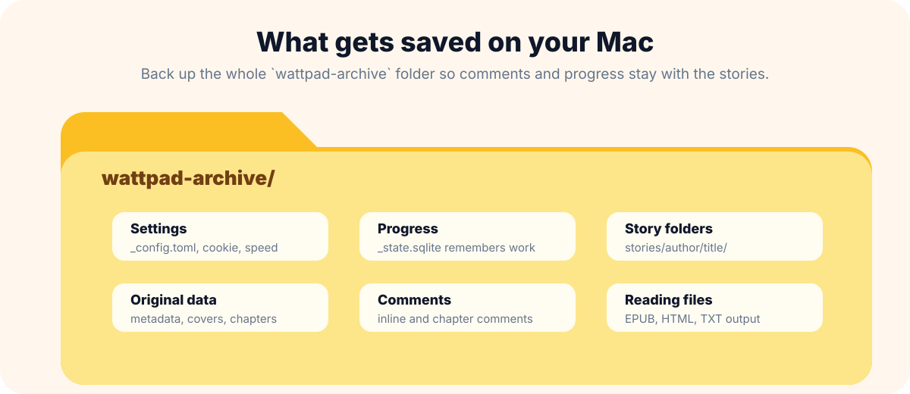

# Wattpad Crawler

Archive Wattpad stories — chapters, inline images, and all comments — to a local
append-only folder before they get removed.


## Acceptable use

Wattpad Crawler is a local-first personal archive tool. Use it only for content you own or have permission to archive, and keep the resulting files for personal backup/offline reading. Do not redistribute archived stories, sell downloaded content, or run this project as a hosted scraping service.
## Desktop App Preview

A Tauri desktop wrapper is available for turning Wattpad Crawler into a native local application instead of a command-line workflow. It keeps the existing Python/FastAPI crawler backend and opens it in a native desktop window.

See `docs/desktop.md` for the current development workflow and packaging plan.

```bash
python -m pip install -e ".[dev]"
npm install
npm run desktop:dev
```

## Install
```bash
git clone <this-repo>
cd "Wattpad Crawler"
python -m venv .venv
# Windows (PowerShell):  .venv\Scripts\Activate.ps1
# Windows (Bash):        source .venv/Scripts/activate
# Linux / macOS:         source .venv/bin/activate
pip install -e .
```

Requires Python 3.11+.

## macOS / MacBook Quick Start

This guide is for someone who wants to save Wattpad stories on a Mac, even if they do not normally use developer tools. Everything stays on your own computer. Nothing is uploaded to a cloud service.



### What you need

- A MacBook or Mac with internet access.
- Your Wattpad account already logged in through Safari, Chrome, or Firefox.
- About 15 minutes for setup. Big libraries can take much longer to download.
- Terminal, which is already included on every Mac.



### 1. Open Terminal

1. Press `Command + Space`.
2. Type `Terminal`.
3. Press `Return`.

Terminal is the app where you paste the commands below.

### 2. Install Homebrew and Python

Homebrew is a common Mac installer. It helps install Python, which runs this tool.

First check whether Homebrew is already installed:

```bash
brew --version
```

If that says `command not found`, install Homebrew from <https://brew.sh>, then close and reopen Terminal.

Install Python:


```bash
brew install python@3.11
```

Check the version:

```bash
python3 --version
```

If `python3 --version` prints `Python 3.11` or newer, continue.

### 3. Download and install Wattpad Crawler

Choose a folder where you want the app files to live. `Downloads` is fine for most people.

```bash
cd ~/Downloads
git clone <this-repo>
cd "Wattpad Crawler"
python3 -m venv .venv
source .venv/bin/activate
python -m pip install --upgrade pip
python -m pip install -e .
```

If Terminal shows `(.venv)` at the start of the line, setup is active.

### 4. Create your local archive folder

```bash
wattpad-crawler --output ./wattpad-archive status
```

This creates a folder named `wattpad-archive`. That folder is where saved stories, covers, comments, EPUB files, HTML files, and settings go.



### 5. Start the local web app

```bash
wattpad-crawler --output ./wattpad-archive serve
```

Open <http://127.0.0.1:8000> in your browser. Keep Terminal open while using the web app. If you close Terminal, the web app stops.

### 6. Add your Wattpad login cookie

Wattpad Crawler needs your Wattpad login cookie so it can save stories your account can read. Treat this cookie like a password. Do not share it.

1. Log in to Wattpad in Safari, Chrome, or Firefox.
2. Open <http://127.0.0.1:8000/setup>.
3. Follow the browser instructions on that page to find the Wattpad `token` cookie.
4. Paste the `token` value into the Setup page.
5. Click **Save**.

If you prefer editing a file, open `./wattpad-archive/_config.toml` and set:

   ```toml
   cookie = "paste-token-here"
   ```

Keep `_config.toml` private because it contains your Wattpad session cookie.

### 7. Save stories

Use the web app buttons to save your library, a reading list, or one story. If you are comfortable with commands, these do the same thing:

```bash
wattpad-crawler --output ./wattpad-archive story 123456789
wattpad-crawler --output ./wattpad-archive url https://www.wattpad.com/story/123456-some-title
wattpad-crawler --output ./wattpad-archive library --user yourusername
```

### 8. Back up your saved stories

Back up the whole `wattpad-archive` folder. Do not copy only the EPUB files. The full folder contains story data, comments, cover images, settings, and local progress.

### macOS Troubleshooting

- **`brew: command not found`:** install Homebrew from <https://brew.sh>, then reopen Terminal.
- **`python: command not found`:** use `python3` before activating `.venv`; after activation, `python` should work.
- **`wattpad-crawler: command not found`:** run `cd ~/Downloads/Wattpad\ Crawler`, then `source .venv/bin/activate`.
- **Web app will not open:** make sure Terminal is still running `wattpad-crawler --output ./wattpad-archive serve`.
- **Private stories fail:** refresh your Wattpad `token` cookie in the Setup page or `./wattpad-archive/_config.toml`.
- **Moving to a new Mac:** copy the full `wattpad-archive` folder.

## Setup (one time)

1. Run the tool once to create a default config:
   ```bash
   wattpad-crawler --output ./wattpad-archive status
   ```
2. Open `./wattpad-archive/_config.toml` in a text editor.
3. Get your Wattpad session cookie:
   - Log in to Wattpad in your browser.
   - Open DevTools → Application/Storage → Cookies → `https://www.wattpad.com`.
   - Copy the value of the `token` cookie.
4. Paste it into `_config.toml` as `cookie = "..."`.
5. (Optional) Adjust `rate_limit_per_sec` (default 2.0) if you want to be politer to Wattpad's servers.

## Usage

```bash
# Archive everything in your library
wattpad-crawler library --user yourusername

# Archive a reading list (by ID — see lists in your Wattpad profile URL)
wattpad-crawler list <list-id>

# Archive a single story
wattpad-crawler story 123456789
wattpad-crawler url https://www.wattpad.com/story/123456-some-title

# Show status of what's been archived
wattpad-crawler status

# Verbose logging (shows every fetch)
wattpad-crawler -v library --user yourusername
```

Re-running is safe and incremental — already-downloaded chapters are skipped, only
new or failed parts are fetched. The local archive is **append-only**: the tool
never deletes a file, even if the remote story is removed from Wattpad.

## Web UI

For a friendlier experience, run the local web UI:

```bash
wattpad-crawler --output ./wattpad-archive serve
```

Then open <http://127.0.0.1:8000> in your browser. Features:

- **Setup:** paste your cookie, save (no terminal needed for this).
- **Dashboard:** click a button to archive your library, a reading list, or a single story.
- **Live progress:** watch chapters and comments stream in via Server-Sent Events.
- **Library:** browse archived stories by cover.
- **Reader:** read chapters in a clean view directly from your local archive.

The web UI calls the same code as the CLI — `_state.sqlite` is the single source of truth for both.

To bind to all interfaces (e.g. for a homelab):

```bash
wattpad-crawler serve --host 127.0.0.1 --port 8081
```

## Output Layout

```
wattpad-archive/
├── _state.sqlite           # manifest (cache; reconstructable from files)
├── _config.toml            # your settings
└── stories/<author>/<story_id>_<slug>/
    ├── metadata.json
    ├── cover.jpg
    ├── parts/
    │   ├── 01_<part_id>_<slug>.json    # canonical chapter data
    │   ├── 01_<part_id>_<slug>.html    # original Wattpad HTML
    │   ├── 01_<part_id>_<slug>.txt     # plain text
    │   ├── 01_<part_id>_comments-inline.json
    │   └── 01_<part_id>_comments-end.json
    └── output/
        ├── <slug>.epub
        ├── <slug>.html
        └── <slug>.txt
```

## What gets archived

- **Story metadata:** title, author, description, tags, vote/read counts, completion status
- **Cover image** (if present)
- **All chapters:** raw HTML, plain text extract, structured JSON with paragraph IDs
- **All comments:** inline (paragraph-attached) and end-of-chapter, with reply threads
- **Final output:** EPUB, standalone HTML, and concatenated TXT, all rebuilt on each run

## Notes & limitations

- Wattpad's API is unofficial. The tool may break if Wattpad changes endpoints or HTML structure.
- The session cookie expires periodically. Refresh it from your browser when login-required content stops working.
- Comments fetching adds significant time — popular stories can have thousands. Be patient on the first run.
- Atomic writes prevent corruption from process kill or Ctrl-C, but power loss may still leave the latest write incomplete.

## Development

```bash
pip install -e ".[dev]"
pytest                    # full unit suite
pytest -v                 # verbose
ruff check wattpad_crawler tests
```

The integration test is skipped by default and requires a vcrpy cassette to be recorded against a real Wattpad public story (instructions in `tests/integration/test_end_to_end.py`).

